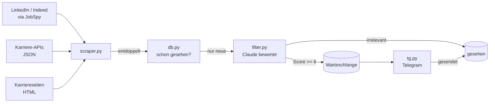

# Job Alert Agent

Automatisierter Job-Agent für den Schweizer Arbeitsmarkt: sammelt Stellen aus
mehreren Quellen, lässt sie von Claude gegen ein hinterlegtes Profil bewerten
und schickt nur die passenden per Telegram – drei Mal pro Woche, vollautomatisch.

Voreingestellt auf **Digital Assets / Blockchain / Fintech in der Schweiz**
sowie **allgemeine IT-Stellen in der Region Zürich / Zug**; das Suchprofil ist
eine einzelne Textdatei und lässt sich auf jeden anderen Werdegang umstellen.


---

## Was der Agent macht

1. **Sammeln** – LinkedIn und Indeed über [JobSpy](https://github.com/speedyapply/JobSpy),
   dazu direkte Karriere-APIs (Bitcoin Suisse, Crypto Finance) und HTML-Karriereseiten
   von Schweizer Banken und Finanzinstituten.
2. **Entdoppeln** – Stellen tauchen quellenübergreifend mehrfach auf. Eine normalisierte
   ID (`(m/w/d)`, `80–100%`, `AG`/`GmbH` werden weggeschnitten) erkennt dieselbe Stelle
   auch dann, wenn LinkedIn und Indeed sie unterschiedlich schreiben.
3. **Bewerten** – Claude bewertet jede neue Stelle gegen das Profil in `profile.txt`:
   Score 1–10, Kategorie, Kurzzusammenfassung, Anforderungen, Remote-Grad.
   Irrelevantes (Scams, unpassende Rollenstufen, ortsfremde Stellen) fällt raus.
4. **Senden** – Die besten Treffer gehen gruppiert nach Kategorie per Telegram raus.
   Was über das Limit hinausgeht, bleibt in einer Warteschlange und kommt beim
   nächsten Lauf – nichts geht verloren.

### Beispiel-Benachrichtigung

```
💼 Job Alert – Montag, 22. September
   12 neue Stellen gefunden

🪙 Krypto & Digital Assets
🟢 Bitcoin Suisse
   Digital Asset Analyst
   📍 Zug  🔀 Hybrid

   Analyse und Betreuung von Krypto-Anlageprodukten für
   institutionelle Kunden.
   • Erfahrung im Digital-Asset-Umfeld
   • Deutsch und Englisch
   [Stelle ansehen]
```

---

## Architektur



Details zu Datenfluss und Designentscheiden: **[docs/architecture.md](docs/architecture.md)**

### Module

| Datei | Aufgabe |
|---|---|
| [main.py](main.py) | Ablaufsteuerung: scrapen → filtern → bewerten → senden |
| [scraper.py](scraper.py) | Quellen (JobSpy, JSON-APIs, HTML), Normalisierung, Deduplizierung |
| [filter.py](filter.py) | Bewertung durch Claude, Profil-Prompt, Scoring |
| [db.py](db.py) | SQLite: gesehene Stellen und Warteschlange |
| [tg.py](tg.py) | Telegram-Ausgabe, Gruppierung, Nachrichten-Splitting |
| [profile.example.txt](profile.example.txt) | Vorlage für das Suchprofil, nach dem bewertet wird |

---

## Setup

```bash
git clone https://github.com/claudiokoller/job-alert-agent.git
cd job-alert-agent

python -m venv .venv && source .venv/bin/activate   # Windows: .venv\Scripts\activate
pip install -r requirements.txt

cp .env.example .env                  # API-Keys eintragen
cp profile.example.txt profile.txt    # eigenes Suchprofil eintragen

python main.py
```

Benötigt Python 3.11+, einen [Anthropic API-Key](https://console.anthropic.com)
und einen Telegram-Bot (via [@BotFather](https://t.me/BotFather)).

### Suchprofil

Wonach gesucht wird, steht nicht im Code, sondern in `profile.txt`: Werdegang,
gesuchte Bereiche und Regionen, passende Rollenstufen. Die Datei geht direkt in
den Bewertungs-Prompt ein – wer den Agenten auf ein anderes Profil ausrichtet,
ändert nur diese eine Datei. Vorlage ist
[profile.example.txt](profile.example.txt); `profile.txt` selbst ist gitignored
und bleibt lokal.

### Weitere Stellschrauben

| Was | Wo |
|-----|-----|
| Suchbegriffe & Arbeitgeber | `JOBSPY_QUERIES` / `DIRECT_EMPLOYERS` in `scraper.py` |
| IT-Suchbegriffe, Orte & Umkreis | `IT_QUERIES` / `IT_LOCATIONS` / `IT_DISTANCE_MILES` in `scraper.py` |
| Mindest-Score | `MIN_SCORE` in `filter.py` |
| Max. Stellen pro Sendung | `MAX_JOBS` in `main.py` |

### Automatisch laufen lassen

Mo/Mi/Fr um 09:00:

```bash
# Linux (crontab -e)
0 9 * * 1,3,5 /usr/bin/python3 /pfad/zu/job_agent/main.py >> /var/log/job_agent.log 2>&1
```

```powershell
# Windows
schtasks /Create /TN "JobAgent" /TR "python C:\pfad\zu\job_agent\main.py" /SC WEEKLY /D MON,WED,FRI /ST 09:00
```

---

## Designentscheide

**Nichts geht still verloren.** Eine Stelle wird erst als „gesehen“ markiert, wenn
sie tatsächlich per Telegram angekommen ist. Schlägt die Bewertung oder der Versand
fehl, bleibt sie offen und wird beim nächsten Lauf erneut versucht.

**Warteschlange statt Abschneiden.** Pro Lauf gehen maximal 15 Stellen raus, damit
die Benachrichtigung lesbar bleibt. Der Rest wandert nicht in den Papierkorb, sondern
in eine nach Score sortierte Warteschlange.

**Bewertung in parallelen Batches.** Jeweils 10 Stellen pro Claude-Anfrage, bis zu
4 Anfragen gleichzeitig. Fällt ein Batch aus, betrifft das nur diesen Batch.

**Selbstüberwachung.** Leere Scrapes, fehlgeschlagene Bewertungen und Telegram-Fehler
meldet der Agent selbst per Telegram – sonst merkt man erst nach Wochen, dass er
stillschweigend nichts mehr findet.

**Robuste Ausgabe.** Schlägt Telegram-Markdown fehl (Sonderzeichen in Stellentiteln),
wird die Nachricht automatisch als Klartext erneut versendet.

## Grenzen

- HTML-Karriereseiten brechen, wenn Arbeitgeber ihr Layout ändern – ein generischer
  Parser filtert Job-Links heuristisch heraus. Seiten hinter Cloudflare oder als
  reine SPA liefern nichts und sind in [scraper.py](scraper.py) dokumentiert.
- Bewertet werden Titel, Firma und Ort, nicht der volle Stellentext – schnell und
  günstig, dafür gelegentlich eine Fehleinschätzung.
- Keine automatisierten Tests; jedes Modul hat stattdessen einen `__main__`-Block
  zum manuellen Ausprobieren (`python scraper.py`, `python filter.py`, `python tg.py`).

## Lizenz

MIT – siehe [LICENSE](LICENSE).
