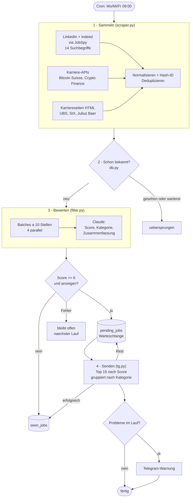

# Architektur

Der Agent ist ein Batch-Job ohne laufenden Prozess: Ein Cron-Eintrag startet
`main.py`, der Lauf dauert wenige Minuten, der Zustand liegt in einer lokalen
SQLite-Datei. Kein Server, keine Queue, keine Container – für drei Läufe pro
Woche wäre alles andere Overhead.

## Ablauf eines Laufs

## Datenmodell

Zwei Tabellen in `job_agent.db`, mehr braucht es nicht:

| Tabelle | Inhalt | Aufbewahrung |
|---|---|---|
| `seen_jobs` | Bereits gemeldete oder als irrelevant verworfene Stellen (ID, Titel, Firma, Zeitpunkt) | 60 Tage |
| `pending_jobs` | Relevante, aber noch nicht gesendete Stellen samt Score und vollem Datensatz als JSON | 14 Tage |

Beide werden bei `init_db()` automatisch aufgeräumt. 60 Tage reichen, um dieselbe
Stelle nicht erneut zu melden; nach 14 Tagen ist ein wartendes Inserat ohnehin
meist weg.

## Zwei Dinge, die den Agenten brauchbar machen

### Deduplizierung über Quellen hinweg

Dieselbe Stelle erscheint auf LinkedIn als `Blockchain Engineer (m/w/d) 80-100%`
bei `SIX Group AG` und auf Indeed als `Blockchain Engineer` bei `SIX Group`. Ein
Hash über die rohen Strings würde beides als zwei Stellen führen.

Die ID entsteht darum über normalisierten Text: Gender-Zusätze, Pensumsangaben,
Rechtsformen und Sonderzeichen fallen weg, danach `md5(titel|firma)`. Beide
Varianten ergeben dieselbe ID – und die Benachrichtigung bleibt sauber.

### Zustand pro Stelle, nicht pro Lauf

Jede Stelle durchläuft drei Zustände: **unbekannt → wartend → gesehen**.

Der Übergang nach „gesehen“ passiert erst, wenn die Stelle entweder als
irrelevant bewertet oder nachweislich per Telegram zugestellt wurde. Das heisst:

- Fällt die Claude-API aus, bleiben die betroffenen Stellen unbekannt und werden
  beim nächsten Lauf erneut bewertet.
- Schlägt der Telegram-Versand fehl, bleiben sie in der Warteschlange.
- Mehr relevante Treffer als das Limit von 15? Der Rest wartet, sortiert nach
  Score, auf den nächsten Lauf.

Ein abgebrochener Lauf kostet damit höchstens Zeit, nie eine Stelle.

## Fehlerbehandlung

Jede Quelle ist einzeln gekapselt – bricht ein Scraper weg, laufen die übrigen
weiter. Am Ende des Laufs sammelt `main.py` alle aufgetretenen Probleme und
schickt sie als Warnung per Telegram:

- keine Stellen gescrapt (Quellen vermutlich defekt)
- Stellen nicht bewertet (API-Fehler, mit Fehlermeldung)
- Stellen nicht zugestellt
- Lauf abgestürzt (Exception-Typ und Meldung)

So fällt ein stiller Ausfall sofort auf, statt erst nach Wochen ohne
Benachrichtigungen.

## Kosten

Bewertet werden nur neue Stellen und nur Titel, Firma und Ort statt des ganzen
Inserats. Pro Lauf sind das typischerweise wenige Dutzend Stellen in einer
Handvoll Anfragen – Centbeträge pro Woche.
