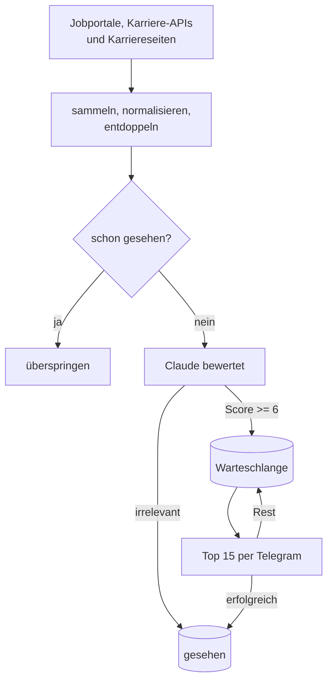

# Architektur

Ein Timer startet `main.py` dreimal pro Woche, der Lauf dauert wenige Minuten,
danach ist der Prozess wieder weg. Der Zustand liegt in einer SQLite-Datei.
Kein Dauerprozess, keine Queue, kein Container – für drei Läufe pro Woche wäre
alles andere Overhead.

## Ablauf

## Datenmodell

Zwei Tabellen, mehr braucht es nicht:

| Tabelle | Inhalt | Aufbewahrung |
|---|---|---|
| `seen_jobs` | Bereits gemeldete oder verworfene Stellen | 60 Tage |
| `pending_jobs` | Relevante, noch nicht gesendete Stellen samt Score | 14 Tage |

## Deduplizierung über Quellen hinweg

Dieselbe Stelle heisst auf LinkedIn `Blockchain Engineer (m/w/d) 80-100%` bei
`SIX Group AG` und auf Indeed `Blockchain Engineer` bei `SIX Group`. Ein Hash
über die rohen Strings würde daraus zwei Stellen machen.

Die ID entsteht darum über normalisierten Text: Gender-Zusätze, Pensumsangaben
und Rechtsformen fallen weg, danach `md5(titel|firma)`. Beide Varianten ergeben
dieselbe ID.

## Zustand pro Stelle, nicht pro Lauf

Jede Stelle durchläuft drei Zustände: **unbekannt → wartend → gesehen**. Der
Schritt nach „gesehen" passiert erst, wenn die Stelle entweder als irrelevant
bewertet oder nachweislich per Telegram zugestellt wurde. Fällt die Claude-API
aus, bleibt sie unbekannt; schlägt der Versand fehl, bleibt sie in der
Warteschlange. Ein abgebrochener Lauf kostet damit Zeit, nie eine Stelle.

## Fehlerbehandlung

Jede Quelle ist einzeln gekapselt – bricht ein Scraper weg, laufen die übrigen
weiter. Am Ende sammelt `main.py` alle Probleme (keine Stellen gescrapt, Stellen
nicht bewertet, Versand fehlgeschlagen, Lauf abgestürzt) und schickt sie als
Warnung per Telegram.

## Erweitern

- **Neue Quelle:** Scraper-Funktion in `scraper.py` ergänzen – sie muss nur
  Titel, Firma, Ort und Link liefern, das Entdoppeln passiert zentral.
- **Anderes Suchprofil:** `profile.txt` anpassen, kein Code nötig.
- **Anderer Kanal:** `tg.py` ersetzen – der Rest des Ablaufs bleibt gleich.
